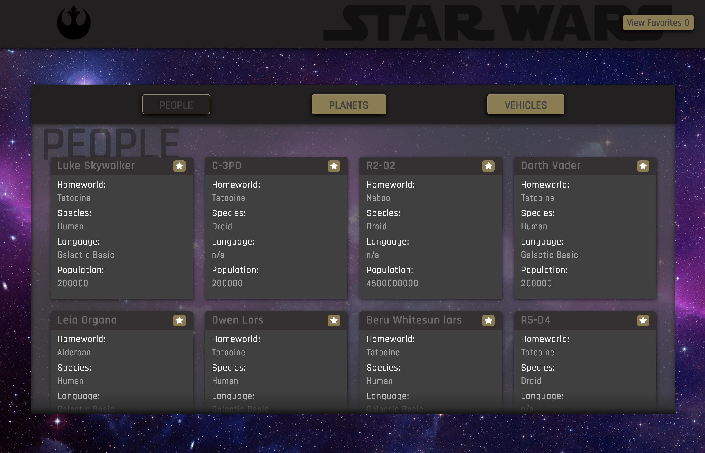

# SwapiBoxRedux

## Descriptions:

This is a Web application that allows the user to their favorite star wars information. These include People, Planets, and Vehicles. The user also has the ability to update and favorite cards.

## Preview:


<img src="./ReadMeImage/favorites.jpg" alt="alt text" width="whatever"


## Getting Started:

These instructions will get a copy of the project up and running on your local machine for usage and testing purposes.

clone down the repository:
```
$ git clone https://github.com/MRKrog/SwapiBoxRedux
```

cd into directory and run npm install:
```
$ npm install
```

launch in your browser:
```
$ npm start
```

## Project Tools:
HTMl\
Javascript\
CSS\
React\
Sass\
React-Router\
Redux


## Original Assignment
[SwapiBox, Mod 3 at the Turing School of Software and Design](http://frontend.turing.io/projects/swapi-box.html)

## Contributors
Michael Krog: https://github.com/MRKrog
